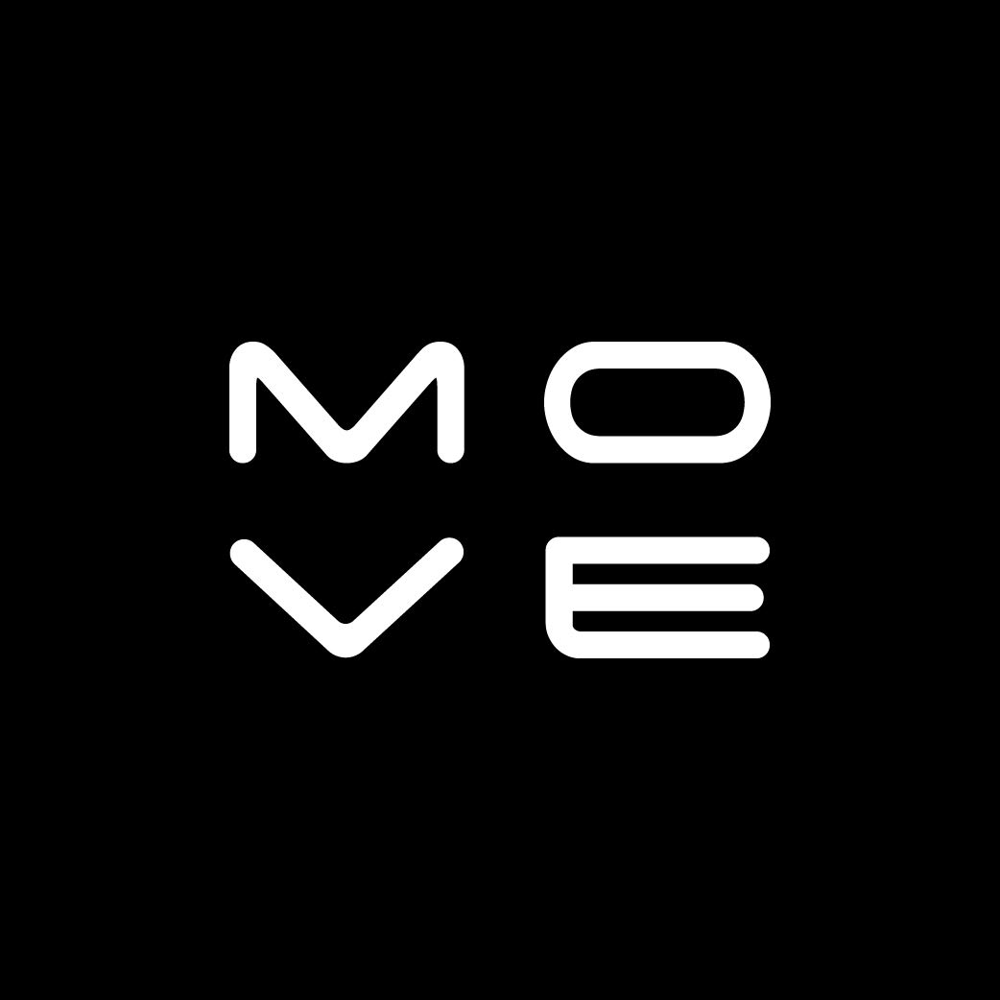
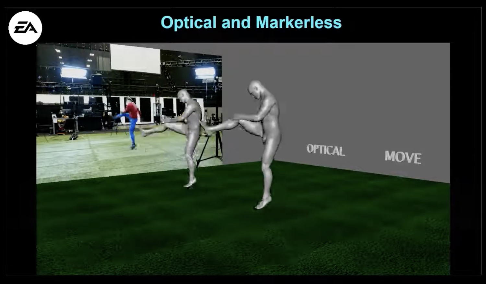

  

# Move AI Recipes
This repo provides examples, guides and tools for using the [Move AI API](https://developers.move.ai/docs/welcome) to 
access models developed by [Move AI](https://move.ai). To run these models, you will need a Move AI API key which you 
can request [here](https://www.move.ai/api).

The models generate spatial motion data related to humans (e.g. human motion and camera positions in different file 
formats) from 2D video input by using physics and AI based estimation techniques.

Most of the code examples are written in Python, although the concepts can be applied in any language.

Some examples live in their own repos and are included here as submodules.

So if you want to get all the examples, make sure to clone the repo recursively (GitHub .zip download will not include the submodules):

`git clone --recursive https://github.com/move-ai/recipes`

## User examples

|  |  |
|:--:|:--:|
| Video game development by Electronic Arts | Music video for MGMT's “Mother Nature” by Eye Garden |

## Models
### Overview
| Model                                                                                                                | Description                                                                                   |
|----------------------------------------------------------------------------------------------------------------------|-----------------------------------------------------------------------------------------------|
| singlecam                                                                                                           | Generates spatial motion data using a single video as input, optimised for quality.           |
| singlecam-turbo  (coming soon)                                                                                   | Generates spatial motion data using a single video as input, optimised for speed and quality. |
| multicam  (coming soon)                                                                                         | Generates spatial motion data using multiple videos as input, optimised for quality.          |
| multi-cam-rt  ([available now, request access here](https://share-eu1.hsforms.com/1J1WzWmHUT_aXIlmv7-b3xwfk5ge)) | Generates spatial motion data using multiple videos as input, optimised for real-time speed.  |

### Single-Camera

* Full body tracking
* Hand and finger tracking
* FBX, USD and Blend 3D output formats
* Track up to 3 people (coming soon)
* Supports any video but best results are obtained when the camera is known

  [More information..](https://help.move.ai/en/collections/8029121-move-one)

### Multi-Camera (coming soon)

* Full body tracking
* Hand and finger tracking
* Track up to TK people
* Track volumes of TKm x TKm
* FBX, USD and Blend 3D output formats
* Supports up to TK cameras
* Tracks large spherical objects (e.g. basketballs, volleyballs)
* Supports any video but best results are obtained when the camera is known

  [More information..](https://help.move.ai/en/collections/8044422-move-multi-cam)

## Code examples

<table>
  <tr>
    <th>Link</th>
    <th>Language</th>
    <th>Description</th>
  </tr>
  <tr>
    <td><a href="examples/Move_API_single_person_single_video_unknown_camera.ipynb">Move_API_single_person_single_video_unknown_camera.ipynb</a></td>
    <td>Python</td>
    <td>Generate 3D animation data of a single person from a single video from an unknown camera</td>
  </tr>
  <tr>
    <td><a href="https://github.com/move-ai/Move_API_JavaScript_demo">Move_API_JavaScript_demo</a></td>
    <td>JavaScript</td>
    <td>Generate 3D animation data of a single person from a single video from an unknown camera</td>
  </tr>
  <tr>
    <td><a href="https://github.com/move-ai/Move_API_and_retargeting_Blender_addon">Move_API_and_retargeting_Blender_addon</a></td>
    <td>Blender Python API</td>
    <td>Move.ai API integrated into Blender via an add-on. Additional features: retargeting, scene import, rendering</td>
  </tr>
  <tr>
    <td><a href="examples/Move_API_ JSON_motion_data_sample_overview.ipynb">Move_API_ JSON_motion_data_sample_overview.ipynb</a></td>
    <td>Python</td>
    <td>Explore and analyse the .JSON motion data output</td>
  </tr>
</table>
