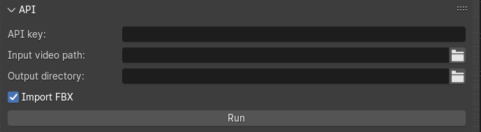
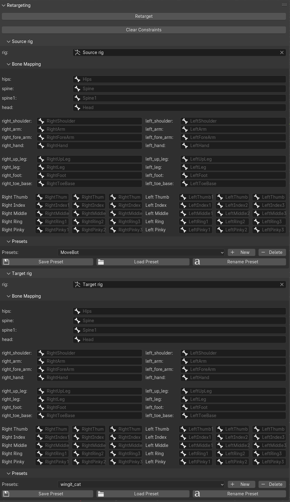
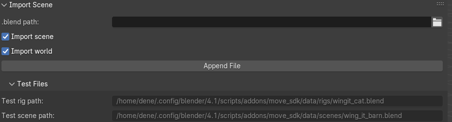
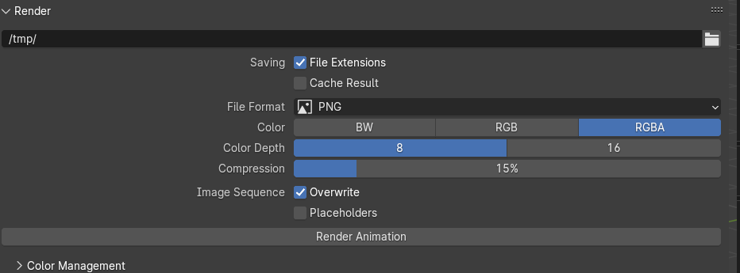

# Move.ai API and retargeting Blender add-on

## Installation

1. Go to Edit > Preferences... > Add-ons
2. Click Install...
3. Select downloaded .zip archive move_sdk_*.zip
4. Click the check box to activate the add-on

## Usage

## API

First, fill in the following fields:

1. `API key` - your Move.ai API key
2. `Input video path` - path to the video you want to process
3. `Output directory` - path to the directory where you want to store the output files processed by Move.ai (.fbx, .usd, .blend, rendered video, etc)
4. Check `Import FBX` if you want the automatic import of the processed 3D animation
5. And finally click the `Run` button

Processing will take a few minutes depending on the length of the `input video`

## Retargeting

After getting the results, you can retarget the animation to another rig.

Our retargeter is robust enough and works with any rigs given that their current pose is aligned (i.e. both rigs are in the T-pose, for example)

1. Select the `Source rig` and `Target rig`
2. Map the bones or alternatively use the mapping presets (you can save, load, remove, rename them)
3. Click `Retarget` button
4. If you want to remove the retargeting, click `Clear Constraints` button

## Import scene

If you want to import another .blend file, you can use our helper `Import Scene` operator

1. Provide the `.blend path` to your .blend file and click `Append File` button

We also provide some test files that you can use to test the retargeting and the scene assembly. Paths to these files are shown in the `Test rig path` and `Test scene path`. Hover the mouse over the field, `Ctrl+C` to copy, hover your mouse over the `.blend path` field and `Ctrl+V`

## Render scene

For the sake of simplicity, we have also duplicated the default Blender's rendering UI into the UI of our add-on.

Simply provide the render path, set your render settings and click `Render Animation`

## Blender Studio's files

We use [Blender Studio's](https://studio.blender.org/) resources for testing and showcasing purposes:

1. [Cat rig](https://studio.blender.org/characters/cat/v1/)
2. [Barn](https://studio.blender.org/films/wing-it/3c308f54ee719e/?asset=6950)

These files were used in the production of the short movie [Wing it!](https://youtu.be/u9lj-c29dxI) and are distributed with the [Creative Commons Attribution 4.0](https://creativecommons.org/licenses/by/4.0/) license.

The original files are slightly changed (optimized) for the better performance.